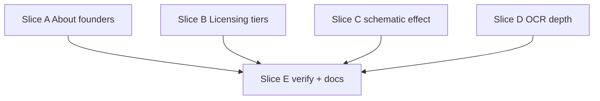

# Inner Pages Hero, Completion Plan (post-audit)

**Audit date:** 2026-07-05  
**Reference:** [inner-pages-hero-migration-goal.md](inner-pages-hero-migration-goal.md), [inner-pages-hero-migration-plan.md](inner-pages-hero-migration-plan.md)  
**Verifier:** `python scripts/verify-revamp.py .verify-scratch` → structural GATE PASS + Playwright/craft checks OK

---

## Executive summary

**G1-G13 are satisfied** for the formal goal gate. The scroll-hero migration, `hero-core` extraction, six-route rollout, `pilotNote` wiring, carapace→cortex merge, and procedural canvas effects are in place.

What remains is **polish and depth** the plan described but the verifier does not enforce: stronger blueprint/schematic visuals, clickable founder profiles on About, licensing tier dollar figures on pricing slides, fuller pitch-deck OCR, and verification hooks so regressions are caught.

---

## Audit matrix

| Criterion | Status | Notes |
|-----------|--------|-------|
| G1 hero-core + thin home | ✅ | `initScrollHero` in `hero-core.js`; home imports it |
| G2 pilotNote | ✅ | Business slide 8; Licensing slides 4-5; static disclaimer above `#agreements` |
| G3 effects | ✅ | `flowchart`, `pcb`, `topology`, `pipeline`, `constellation`, `vault`; home 3→`topology`, 4→`pcb` |
| G4 OCR slides | ⚠️ Minimum | Sections exist for slides 01-11; **only 04, 05, 08 have real copy**, rest are `OCR unavailable` placeholders |
| G5 visual assets | ✅ | `docs/visual-assets.md` documents **procedural fallback** (no `assets/schematics/` or `assets/models/`) |
| G6 six routes | ✅ | `hero-stage` on index, about, business, licensing, solutions, cortex |
| G7 About | ⚠️ Mostly | 7 slides, ontology, no `about-legacy`/carousel - **team slide lacks GitHub links** |
| G8 Business | ✅ | 8 slides, `$12K → $24K+`, `#contact` form tail, hero fade-out |
| G9 Licensing | ⚠️ Mostly | 6 slides, PDF grid, disclaimer - **slides 4-5 have `pilotNote` but no tier $ figures** |
| G10 Solutions | ✅ | 10 slides; no `Solutions-*.png` gallery or lightbox |
| G11 Cortex merge | ✅ | ~10 slides, carapace tail merged, `carapace.html` redirects; slide 2 uses `flowchart` + fallback note |
| G12 verify | ✅ | Full verify run passes |
| G13 no carousel/bloom on migrated pages | ✅ | Migrated HTML clean; `cortex-bloom-bg.js` only on loi/thank-you (out of scope) |

---

## Deep-dive: wireframe / diagram / blueprint capability

### What shipped (satisfies G3, G5, G11)

- **Procedural canvas effects** in `effects-anime.js` cover the wireframe/diagram metaphors: orthogonal `flowchart`, trace `pcb`, hub `topology`, stage `pipeline`, node `constellation`, seal `vault`.
- **Phase 1b asset search** completed; decision recorded in `docs/visual-assets.md`, no CC0/MIT assets met criteria, so migrations correctly did **not** block on files.
- **Cortex slide 2** uses `flowchart` (Capture→Route→Approve→Execute) with note pointing at `visual-assets.md` fallback.

### What the plan mentioned but did not ship

| Item | Plan reference | Current state | Severity |
|------|----------------|---------------|----------|
| Optional `schematic` canvas effect | Slice 3, Phase 1 fallback line | **Not in `effects-anime.js`** | Medium, distinct “engineering blueprint” look vs box flowchart |
| `#schematic-layer` DOM hook in `hero-core` | Phase 1b integration path | **Not wired** | Low until SVG assets exist |
| SVG tier-A / glTF tier-B | Phase 1b, Cortex slide 2+ | **Deferred to Phase 2** per fallback rule | Low (documented) |
| `schematic` on stat slides (optional) | Phase 1 | Not used | Low |

### Interpretation

Formal acceptance criteria treat **procedural fallback as sufficient**. If the intent is a *visible* blueprint/engineering-diagram layer (not just flowchart boxes), that is an **enhancement slice**, not a migration blocker.

---

## Deep-dive: About team / founders

### What shipped (satisfies G7 textually), Slide 6 in `hero-about.js`: eyebrow **Team**, proof chips `@triphosphatedev` and `@ascendism` with **Co-founder** roles., OCR in `docs/site-copy-ocr.md` confirms handles and roles from `slide-08-team-updated.png`., Legacy carousel, `about-legacy`, and duplicated belief/engagement walls are gone.

### Gaps vs plan intent

| Gap | Detail |
|-----|--------|
| **No clickable GitHub profiles** | `text-anime.js` supports `proof[].source` → `<a>` chips (see home Asana chips). Team chips use plain `span`, handles are labels only. |
| **Role copy drift** | OCR: “client delivery”; hero: “delivery”, align to OCR wording. |
| **Weak team visual** | Slide 6 uses generic `mesh`; plan table lists `mesh` but founders are buried in proof chips, not title/sub. |
| **Verifier blind spot** | `verify-revamp.py` checks OCR doc, not `hero-about.js` for handles. |

### Recommended team slide shape

```js
// hero-about.js slide 6, target
{
  eyebrow: "Team",
  title: "Co-Founders",
  sub: "…",
  proof: [
    { label: "@triphosphatedev", detail: "Co-founder, engineering & platform architecture.",
      source: "https://github.com/triphosphatedev" },
    { label: "@ascendism", detail: "Co-founder, product, operations & client delivery.",
      source: "https://github.com/ascendism" }
  ],
  effect: "constellation" // or new schematic, two-node founder graph
}
```

---

## Other gaps worth closing

1. **Licensing tier figures**, Plan Phase 4 slides 4-5: “Commercial deploy + tier figures” with `pilotNote`. Chips cite agreements but **no $ amounts** (order-form sample has $499/mo platform, $399/mo commercial, add-ons). Add proof chips or title/sub figures + keep `pilotNote`.
2. **OCR depth**, Run Tesseract (or manual transcription) for slides 01-03, 06-07, 09-11; keep 07/10 financials **internal-only** per R5.
3. **Nav consistency**, Inner pages include **Home** link; `index.html` nav omits it (brand → `#top`). Harmonize or document as intentional.
4. **Cache-bust drift** - `cortex.html` / tail pages use `20260705b`; others `20260705a`. Unify on ship.
5. **Plan doc hygiene**, Checkboxes in `inner-pages-hero-migration-plan.md` still `[ ]`; mark done or archive.

---

## Completion slices (recommended order)

### Slice A, About founders (1 turn, high visibility)

**Scope:** Team slide polish only.

**Files:** `assets/hero-about.js`, optionally `about.html` SSR slide 6 if advancing default view.

**Tasks:**
1. Add `source` URLs to both founder proof chips.
2. Align role strings to `site-copy-ocr.md` slide-08.
3. Optionally retitle slide to “Co-Founders” and switch effect to `constellation` (2 highlighted nodes).
4. Extend `verify-revamp.py`: grep `hero-about.js` for `triphosphate` and `ascendism`.

**Done when:** Scrolling to About slide 6 shows linked GitHub chips; verify asserts handles in JS.

---

### Slice B, Licensing tier figures (1 turn)

**Scope:** Slides 4-5 dollar copy from order-form sample / `site-copy-extract.md` (not investor ARR).

**Files:** `assets/hero-licensing.js`

**Tasks:**
1. Slide 4: add tier proof chips (e.g. platform $499/mo, commercial $399/mo), pilot-phase framing in `note`, keep `pilotNote: true`.
2. Slide 5: retainer/add-on figures ($199/mo support, etc.) with same disclaimer pattern.
3. Verify: grep hero-licensing for `\$` or `pilotNote` + pricing keywords.

**Done when:** Pricing slides show figures + disclaimer; no ARR/funding numbers from slides 07/10.

---

### Slice C, Blueprint / schematic effect (1-2 turns, optional enhancement)

**Scope:** Distinct procedural `schematic` effect + wire on Cortex slide 2 (and optionally About slide 7 pipeline).

**Files:** `assets/effects-anime.js`, `assets/hero-cortex.js`, `scripts/test-effects-ids.mjs`

**Tasks:**
1. Implement `schematic` id: thin stroke orthographic layers, dimension ticks, dashed blueprint grid, OKLCH-tinted, non-photorealistic.
2. Cortex slide 2: `effect: "schematic"` (or layered `flowchart` + `schematic` if engine supports composite, else pick one).
3. Update `visual-assets.md`: “Phase 1 procedural schematic effect ships; SVG layer still Phase 2.”
4. Add `schematic` to effects smoke test.

**Done when:** Cortex slide 2 reads as engineering blueprint; smoke test includes `schematic`.

**Defer:** `#schematic-layer` + static SVG until a vetted asset exists.

---

### Slice D, OCR completion (parallel / low priority)

**Scope:** Fill placeholder sections in `site-copy-ocr.md`.

**Files:** `scripts/ocr-slides.py`, `docs/site-copy-ocr.md`

**Tasks:**
1. Install/run Tesseract locally or transcribe manually from `assets/slide-*.png`.
2. Populate slides 01-03, 06, 09, 11; slide 07/10 marked **internal, do not publish**.
3. Extend verify: fail if slide-01 section still says `OCR unavailable` (optional strict gate).

---

### Slice E, Verification + doc close-out (1 turn)

**Scope:** Harden gates; mark migration complete in docs.

**Files:** `scripts/verify-revamp.py`, `docs/inner-pages-hero-migration-goal.md`, `docs/inner-pages-hero-migration-plan.md`

**Tasks:**
1. Add structural checks: `hero-about.js` founders, `hero-licensing.js` pricing pattern, `schematic` or cortex fallback note.
2. Unify cache-bust query strings across hero HTML/CSS/JS.
3. Mark plan todos complete; add “Completion plan” link to goal doc.

**Done when:** `verify-revamp.py` exit 0 with new assertions; docs reflect shipped state.

---

## Parallel map



**Critical path for user-visible gaps:** A → B → E (founders + pricing).  
**Blueprint polish:** C can run parallel with A/B.

---

## Turn checklist

```
[x] Migration goal G1-G13, PASS (2026-07-05 verify)
[x] Slice A, About founders: GitHub links + copy align + verify hook
[x] Slice B, Licensing slides 4-5 tier $ figures
[x] Slice C, Optional schematic canvas effect on Cortex slide 2
[ ] Slice D, Full slide OCR (strict) or accept placeholders
[x] Slice E, Verify hardening + cache-bust + doc close-out
```

---

## Commands (per slice)

```bash
# After A
rg "triphosphate|ascendism" assets/hero-about.js docs/site-copy-ocr.md

# After B
rg "pilotNote|\$" assets/hero-licensing.js

# After C
rg 'id === "schematic"' assets/effects-anime.js
node scripts/test-effects-ids.mjs .verify-scratch

# Final
python scripts/verify-revamp.py .verify-scratch
```