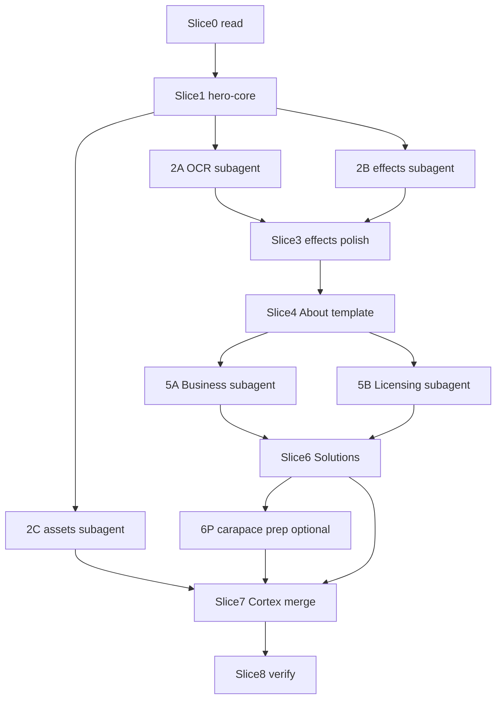

# Goal: Inner Pages Scroll-Hero Migration

**Use this file as the goal brief.** Reference plan: [inner-pages-hero-migration-plan.md](inner-pages-hero-migration-plan.md). Post-migration polish: [inner-pages-hero-completion-plan.md](inner-pages-hero-completion-plan.md).

---

## Goal statement

Migrate About, Business, Licensing, Solutions, and Cortex from craft-photo heroes + carousels to the home page’s scroll-pinned pseudo-scroll hero system. Extract shared `hero-core.js`, add `pilotNote` pricing disclaimers, ship Phase 1 canvas effects, optionally source free schematic/3D assets, deduplicate copy (About = identity/ontology/team), merge `carapace.html` into Cortex, and pass automated verification on all routes.

---

## Goal success criteria (all must pass)

| # | Criterion | How to verify |
|---|-----------|---------------|
| G1 | `assets/hero-core.js` exists; `hero-home.js` is a thin wrapper; home still boots | `index.html` has `#hero-stage`; no console errors on load |
| G2 | `pilotNote: true` renders muted disclaimer on Business slide 8 and Licensing slides 4-5 | Visual check + grep `pilot-note` in DOM after scroll |
| G3 | `flowchart`, `pcb`, `topology`, `pipeline` (+ `constellation`, `vault`) work in `effects-anime.js` | No throw on slide change; home slides 3-4 use `topology` / `pcb` |
| G4 | `docs/site-copy-ocr.md` includes OCR for `assets/slide-01`-`slide-11` (at least 04, 05, 08) | File contains `slide-08-team` section with @triphosphatedev / @ascendism |
| G5 | `docs/visual-assets.md` exists, assets listed **or** explicit “procedural fallback” decision | File present with license log or fallback note |
| G6 | All six routes use scroll hero: `about`, `business`, `licensing`, `solutions`, `cortex`, `index` | `grep -l hero-stage *.html` → 6 files |
| G7 | About: 7 slides, ontology + team (GitHub handles only), no legacy carousel/hidden block | `about-legacy` gone; no inline carousel JS |
| G8 | Business: 8 slides + intake form tail at `#contact` | Form still submits; carousel removed |
| G9 | Licensing: 6 slides + PDF grid; disclaimer above `#agreements`; no `carapace.html` CTA | Grep licensing for broken CTA |
| G10 | Solutions: ~10 slides only; no `Solutions-*.png` gallery or lightbox | No lightbox script; no solutions infographic imgs in main |
| G11 | Cortex: ~10 slides; carapace download content merged; `carapace.html` redirects | `carapace.html` meta/JS redirect to `cortex.html` |
| G12 | Nav unified; `scripts/verify-revamp.py` passes | `python scripts/verify-revamp.py .verify-scratch` exit 0 |
| G13 | No inline carousel JS on migrated pages; no `cortex-bloom-bg.js` on inner pages | Grep confirms |

**Goal is DONE when G1-G13 all pass.**

---

## Turn slices (one slice ≈ one orchestrator turn)

Each slice has: **scope**, **outputs**, **slice done when**, **do not start until**.

### Slice 0, Prerequisite read (orchestrator only, no code)
- **Scope:** Read `index.html`, `assets/hero-home.js`, `docs/site-copy-ocr.md`, `docs/carapace-ontology.txt`
- **Outputs:** Mental model of slide schema + HTML shell
- **Done when:** Orchestrator can list required DOM ids
- **Blocks:** Slice 1

---

### Slice 1 - `hero-core` + `pilotNote` + home regression
- **Scope:** Extract `initScrollHero` to `assets/hero-core.js`; thin `hero-home.js`; add `pilotNote` to `text-anime.js` + `.pilot-note` CSS; home unchanged visually
- **Files:** `hero-core.js` (new), `hero-home.js`, `text-anime.js`, `hero-home.css`
- **Done when:** G1 pass; home scroll + theme toggle work
- **Blocks:** Slices 2, 3, 4, 5+

---

### Slice 2, Parallel prep (3 subagents) ⬦

Run **in parallel** after Slice 1. Orchestrator merges + resolves conflicts.

| Track | Subagent task | Files | Track done when |
|-------|---------------|-------|-----------------|
| **2A OCR** | `scripts/ocr-slides.py`; OCR `assets/slide-*.png`; append `docs/site-copy-ocr.md` | `ocr-slides.py`, `site-copy-ocr.md` | Slides 04, 05, 08 sections exist |
| **2B Effects core** | Add `flowchart`, `pcb`, `topology`, `pipeline` to `effects-anime.js` | `effects-anime.js` | Four ids in `ensureEffect` / `_drawEffect` |
| **2C Visual assets** | Web search CC0/MIT SVG + glTF; write `docs/visual-assets.md`; download to `assets/schematics/` or `assets/models/` if suitable | `visual-assets.md`, optional asset dirs | G5 pass |

**Slice 2 done when:** 2A + 2B + 2C tracks complete; orchestrator smoke-tests one effect id per new effect on home.

**Do not start until:** Slice 1

---

### Slice 3, Effects polish + home retune
- **Scope:** Add `constellation`, `vault`, (`schematic` optional); retune home slides 3→`topology`, 4→`pcb`
- **Files:** `effects-anime.js`, `hero-home.js`
- **Done when:** G3 pass
- **Blocks:** Page migrations (need full effect set for About slide 4-5)
- **Can parallel with:** Slice 4 only if 2B merged first

---

### Slice 4, About template (first full page migration)
- **Scope:** Rewrite `about.html` with hero shell; `assets/hero-about.js` (7 slides); remove `about-legacy` + carousel JS; post-hero CTA only
- **Files:** `about.html`, `hero-about.js`
- **Done when:** G6 (about), G7 pass; About scrolls 7 slides
- **Blocks:** Slices 5A/5B (pattern proof)
- **Do not start until:** Slices 1 + 3

---

### Slice 5, Parallel page migrations (2 subagents) ⬦

| Track | Subagent task | Files | Track done when |
|-------|---------------|-------|-----------------|
| **5A Business** | `business.html` + `hero-business.js` (8 slides, `pilotNote` slide 8); keep `#contact` form tail | `business.html`, `hero-business.js` | G8 pass |
| **5B Licensing** | `licensing.html` + `hero-licensing.js` (6 slides, `pilotNote` 4-5); PDF tail + disclaimer; fix carapace CTA | `licensing.html`, `hero-licensing.js` | G9 pass |

**Slice 5 done when:** 5A + 5B complete; orchestrator spot-checks `pilot-note` on pricing slides.

**Do not start until:** Slice 4

---

### Slice 6, Solutions (solo turn, largest slide count)
- **Scope:** `solutions.html` + `hero-solutions.js` (~10 slides from `site-copy-ocr.md`); remove infographic gallery + lightbox
- **Files:** `solutions.html`, `hero-solutions.js`
- **Done when:** G10 pass
- **Do not start until:** Slice 5

**Optional parallel:** Subagent **6P** can read `carapace.html` + draft merge notes for Slice 7 while 6 runs (read-only prep).

---

### Slice 7, Cortex merge + redirect + optional assets
- **Scope:** Merge carapace download/GitHub into `cortex.html`; `hero-cortex.js` (~10 slides); wire SVG schematic layer if Slice 2C found assets; `carapace.html` redirect stub; trim redundant cortex grids
- **Files:** `cortex.html`, `hero-cortex.js`, `carapace.html`, optional `hero-core.js` schematic layer
- **Done when:** G11 pass; Cortex slide 2 has schematic OR procedural fallback documented
- **Do not start until:** Slices 2C (manifest), 6

---

### Slice 8, Nav unify + verification hardening
- **Scope:** Standard nav on all pages; update `verify-revamp.py` (hero-stage on all routes, no carousel checks); run full verify; cache-bust versions
- **Files:** all HTML, `verify-revamp.py`, `site.js` refs
- **Done when:** G12, G13 pass; **goal complete**

---

## Parallel execution map



**Maximum parallelism:**, After Slice 1: **3 subagents** (2A, 2B, 2C), After Slice 4: **2 subagents** (5A, 5B), During Slice 6: **1 optional read-only subagent** (6P)

---

## Subagent brief templates (copy-paste)

### 2A, OCR slides
```
Task: Create scripts/ocr-slides.py, OCR assets/slide-01 through slide-11,
append results to docs/site-copy-ocr.md. Priority: slide-04, slide-05 ($12K→$24K),
slide-08 (team: @triphosphatedev, @ascendism). Do not edit HTML.
Return: confirmation sections added + any figures found for Business slide 8.
```

### 2B, Canvas effects (core four)
```
Task: Add flowchart, pcb, topology, pipeline to assets/effects-anime.js.
Match existing effect style (wireframe, OKLCH, ambient). Do not edit HTML or page modules.
Return: effect ids list + line count added.
```

### 2C, Visual asset sourcing
```
Task: Search for CC0/MIT SVG schematics and low-poly glTF (chip/PCB/motherboard).
Write docs/visual-assets.md with license log. Download suitable files to
assets/schematics/ or assets/models/. If nothing suitable, document procedural fallback.
Do not add three.js yet.
Return: manifest summary + file paths or fallback decision.
```

### 5A, Business page
```
Task: Migrate business.html to scroll hero using hero-core.js pattern from about.html.
Create assets/hero-business.js with 8 slides per plan. pilotNote:true on slide 8.
Keep #contact intake form as post-hero tail. Remove carousel JS.
Depends on: hero-core.js, effects-anime.js with all effects.
Return: slide count + pilotNote confirmation.
```

### 5B, Licensing page
```
Task: Migrate licensing.html to scroll hero. Create assets/hero-licensing.js (6 slides).
pilotNote:true on slides 4-5. PDF grid below hero with disclaimer above #agreements.
Fix CTA carapace.html → cortex.html. Remove craft hero/carousel.
Return: slide count + disclaimer locations.
```

### 6P, Carapace merge prep (read-only)
```
Task: Read carapace.html and cortex.html. List unique carapace content to merge
(download links, experimental notice, best-for/not-for). Do not edit files.
Return: bullet list for Slice 7 orchestrator.
```

---

## Per-slice verification commands

```bash
# After Slice 1
rg "initScrollHero|hero-core" assets/

# After Slice 2A
rg "slide-08|slide-05|triphosphate|ascendism" docs/site-copy-ocr.md

# After Slice 2B/3
rg "flowchart|pcb|topology|pipeline|constellation|vault" assets/effects-anime.js

# After Slice 4+
rg -l "hero-stage" *.html

# After Slice 5
rg "pilotNote:\s*true" assets/hero-business.js assets/hero-licensing.js

# After Slice 6
rg "Solutions-.*\.png|lightbox" solutions.html   # should be empty

# After Slice 7
rg "carapace\.html|cortex\.html" carapace.html   # redirect target

# Final (Slice 8)
python scripts/verify-revamp.py .verify-scratch
```

---

## Risk gates (orchestrator stops and fixes before continuing)

| Gate | Condition | Action |
|------|-----------|--------|
| R1 | Home breaks after Slice 1 | Fix before any parallel work |
| R2 | OCR finds no team handles | Use plan defaults @triphosphatedev / @ascendism; note in OCR doc |
| R3 | Effect id missing at page migrate | Complete Slice 3 before that page |
| R4 | Subagent edits same file | Orchestrator serializes merge (effects-anime.js most likely) |
| R5 | Investor ARR from slides 07/10 | Do not publish on site; OCR for internal reference only |

---

## Goal metadata

| Field | Value |
|-------|-------|
| Estimated turns | 8 orchestrator + up to 6 subagent |
| Critical path | S1 → S2B → S3 → S4 → S5 → S6 → S7 → S8 |
| Parallel savings | ~2 turns via S2 (3-way) + S5 (2-way) |
| Primary plan doc | [inner-pages-hero-migration-plan.md](inner-pages-hero-migration-plan.md) |
| Copy sources | [site-copy-ocr.md](site-copy-ocr.md), [site-copy-extract.md](site-copy-extract.md), [carapace-ontology.txt](carapace-ontology.txt) |

---

## Turn checklist (orchestrator copy)

```
[ ] Slice 0, Read prerequisites
[ ] Slice 1, hero-core + pilotNote (G1)
[ ] Slice 2, Parallel: 2A OCR | 2B effects | 2C assets (G4, G5 partial)
[ ] Slice 3, constellation/vault + home retune (G3)
[ ] Slice 4, About template (G6, G7)
[ ] Slice 5, Parallel: 5A Business | 5B Licensing (G8, G9)
[ ] Slice 6, Solutions (G10)
[ ] Slice 7, Cortex + carapace redirect (G11)
[ ] Slice 8, Nav + verify-revamp (G12, G13)
[ ] GOAL COMPLETE, all G1-G13 pass
```