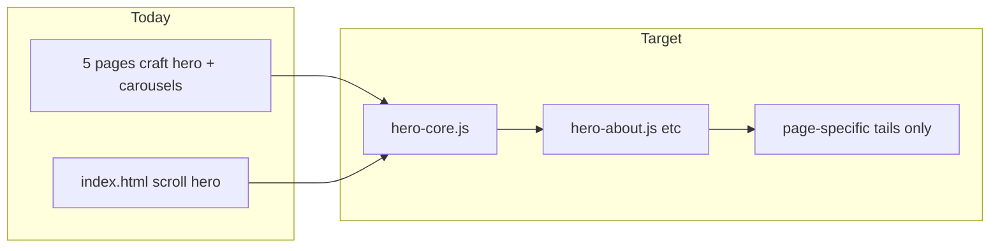
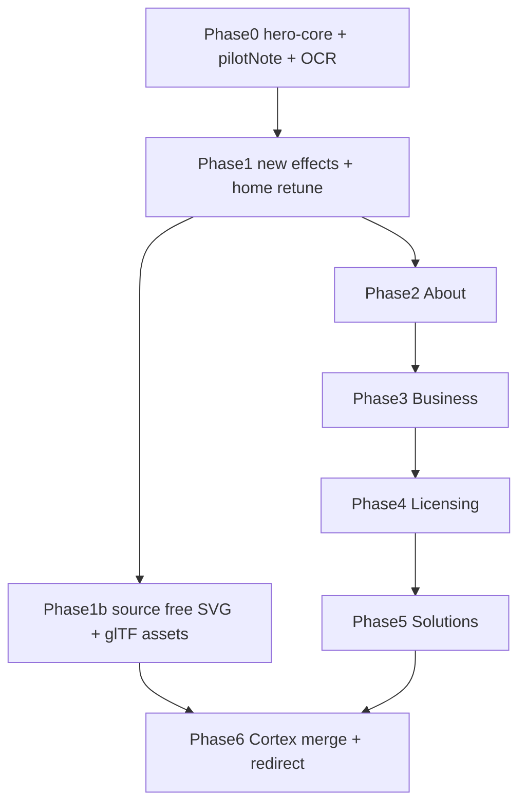

> Extract a shared scroll-hero engine from the home page, add pilot pricing disclaimers and Phase 1 canvas effects, then migrate About/Business/Licensing/Solutions/Cortex to the pseudo-scroll system with deduplicated copy, making About the authoritative philosophy/ontology/team page and merging carapace.html into Cortex.

# Inner Pages Scroll-Hero Migration

_Session plan mirror, also stored under Grok sessions. Last updated: 2026-07-05._

**Goal execution brief (turn slices, parallel subagents, G1-G13 criteria):** [inner-pages-hero-migration-goal.md](inner-pages-hero-migration-goal.md)

## Current state

- **Home** ([index.html](../index.html)) is the only page on the scroll-pinned hero: `#hero-stage` + [assets/hero-home.js](../assets/hero-home.js) + [assets/hero-home.css](../assets/hero-home.css) + [assets/effects-anime.js](../assets/effects-anime.js).
- **Five inner pages** (about, business, licensing, solutions, cortex) use craft photo heroes ([assets/pages-craft.css](../assets/pages-craft.css)), inline carousels, and long editorial `<main>` sections.
- **Copy inventory** is ready in [docs/site-copy-ocr.md](site-copy-ocr.md) (infographics + `ideas/` pitch deck) and [docs/site-copy-extract.md](site-copy-extract.md) (HTML + PDFs). Ontology source: [docs/carapace-ontology.txt](carapace-ontology.txt).
- **Gap:** `assets/slide-01` through `slide-11` exist but are **not OCR’d** and not wired into HTML. Run OCR before using team/traction/financial figures from slides 04, 07, 08, 10.



---

## Phase 0, Shared infrastructure

### 1. Extract `hero-core.js`

Refactor [assets/hero-home.js](../assets/hero-home.js) (~320 lines of orchestration) into [assets/hero-core.js](../assets/hero-core.js):

- `initScrollHero({ slides, pageClass, stageHeight?, ctaSection? })`, scroll math, atmosphere, theme toggle, meta chrome, WASM chips, fade-out into CTA, Keep [assets/hero-home.js](../assets/hero-home.js) as a thin wrapper: `HERO_SLIDES` + `initScrollHero(...)`

Shared slide schema (extend current shape in `HERO_SLIDES`):

```js
{
  eyebrow, title, sub, note,
  proof: [{ label, detail?, source?, stat? }],
  oklch: { L, h, rel },
  effect,           // canvas effect id
  bokeh,
  pilotNote: false   // NEW, see below
}
```

### 2. Pilot pricing disclaimer (global rule)

**Constant** in `hero-core.js`:

> Pilot program pricing. Figures reflect our current testing phase and are subject to change once pilots complete and the model is validated.

When `pilotNote: true`, [assets/text-anime.js](../assets/text-anime.js) renders an extra muted line:

```html
<p class="pilot-note text-el" data-layer="pilot-note">…</p>
```

Style in [assets/hero-home.css](../assets/hero-home.css) (rename to `hero.css` or keep filename, scope globally): smaller type, reduced opacity, sits below `.note`.

| Page | Slides with `pilotNote: true` |
|------|-------------------------------|
| Business | Slide 8 (commercial path: $12K → $24K+), figures from slide-05 OCR |
| Licensing | Slides 4-5 (tier pricing); plus static line above PDF grid in post-hero tail |
| Home / Cortex / Solutions / About | Only if dollar figures added later |

### 3. Shared HTML shell (per page)

Replace each page’s `<header class="hero">` + carousel blocks with the same layer stack as [index.html](../index.html) lines 43-155:

- `#atmosphere`, `#bokeh-layer`, `#text-veil`, `.hero-chrome`, `#slide-rail`, `#scroll-hint`, `#hero-stage` → `#pinned` → `#slide-content`, SSR first slide in HTML for SEO, Early theme script + favicon (currently missing on inner pages), Load `assets/hero.css` + page module `assets/hero-{page}.js`, Drop `cortex-bloom-bg.js` on migrated pages (effects engine replaces it), Remove all inline carousel JS (~90 lines × 3 files)

### 4. OCR investor slides

Add [scripts/ocr-slides.py](../scripts/ocr-slides.py) (or extend [scripts/extract-site-copy.py](../scripts/extract-site-copy.py)) to OCR `assets/slide-*.png` → append to [docs/site-copy-ocr.md](site-copy-ocr.md).

**Priority:** slide-08-team (confirm @triphosphatedev, @ascendism roles), slide-05-business-model ($12K→$24K path), slide-04-traction. **Do not publish** slide-07/10 financials/ARR on marketing pages unless explicitly approved after OCR review.

### 5. Unify nav + verification, Standard nav on all pages: Home · How We Help · Solutions · Licensing · Pitch Deck · About · Cortex · Contact (business only), Update [scripts/verify-revamp.py](../scripts/verify-revamp.py): expect `hero-stage` on all primary routes; drop carousel checks

---

## Phase 1, Canvas effects (before page migrations)

Extend [assets/effects-anime.js](../assets/effects-anime.js) with four procedural effects (wireframe-tinted, ambient, never photorealistic):

| Effect | Visual | Used for |
|--------|--------|----------|
| `flowchart` | Orthogonal boxes + edge packets | D→D→M→E, Capture→Route→Approve→Execute, Land→Convert→Expand, 4 principles |
| `pcb` | Traces + pad pulses | Silicon/infrastructure metaphor |
| `topology` | Hub-and-spoke | Human API, email/files/portals → center |
| `pipeline` | Horizontal stage nodes + sequential pulse | Commercial path, Carapace→Cortex |

**Optional same phase:** `constellation` (6 ontology nodes), `vault` (shield variant), `schematic` (stat slides).

**Home retune** ([assets/hero-home.js](../assets/hero-home.js)): slide 3 → `topology`, slide 4 → `pcb`.

---

## Phase 1b, Source free schematic & 3D assets (parallel with Phase 1)

**Goal:** Find usable, license-clear tech-oriented visuals before building custom geometry. If sourcing succeeds, wire assets in; if not, procedural canvas effects remain the fallback (no blocker).

### 1. Search & evaluate (document in `docs/visual-assets.md`)

| Tier | What to hunt | Likely sources | License requirement |
|------|----------------|----------------|---------------------|
| **A, SVG schematics** | PCB outlines, chip die, motherboard wireframes, block diagrams | Wikimedia Commons, OpenClipart, GitHub OSS repos (KiCad exports, SVG icon sets), Figma community exports | CC0, CC-BY (attribution in docs), MIT, or equivalent commercial-safe |
| **B, glTF / GLB** | Low-poly chip, SoC, motherboard, server blade | Sketchfab (CC0 filter), Poly Pizza, Kenney, Khronos glTF sample repo | CC0 or explicit commercial use; prefer <150KB per model |
| **C, Skip** | STEP/CAD, photorealistic renders, trademarked part numbers | - | Do not use |

**Search queries to run:** `site:sketchfab.com CC0 chip`, `site:commons.wikimedia.org circuit board svg`, `github pcb svg wireframe`, `glb motherboard low poly CC0`.

### 2. Acceptance criteria per asset, Wireframe or line-art style (not photorealistic), Works behind text veil + bokeh at low opacity, Single-color or easily OKLCH-tinted via CSS/canvas, File size: SVG <50KB; glTF/GLB <150KB, License recorded in `docs/visual-assets.md` (name, URL, license, attribution line if required)

### 3. Repo layout if assets are found

```
assets/schematics/     # SVG wireframe overlays (static, behind canvas)
assets/models/         # glTF/GLB (Phase 2 only if tier B succeeds)
docs/visual-assets.md  # manifest + license log
```

### 4. Integration paths (only if sourcing succeeds)

| Asset type | Where used | How |
|------------|------------|-----|
| **SVG schematic** | Cortex product slides (esp. slide 2), optional Home slide 4 | Static `#schematic-layer` behind `#field` canvas; OKLCH stroke via CSS `color-mix`; no interaction |
| **glTF wireframe** | Cortex slide 2 proof-of-concept | `three.js` (~150KB CDN) + `MeshBasicMaterial` wireframe; ambient rotation; veil unchanged |
| **SVG block diagram** | Licensing / Business flowchart slides | Optional background under procedural `flowchart` effect |

### 5. Fallback rule

If no suitable asset is found after the search pass, **do not delay page migrations**, procedural `pcb`, `flowchart`, and `schematic` canvas effects cover the same metaphors. Revisit sourcing when Cortex Phase 2 lands.

**Gate:** Complete search + manifest before Cortex merge (Phase 6). SVG tier-A can ship earlier on Cortex if found during Phase 1b.

---

## Phase 2, About (authoritative identity page)

**Goal:** About becomes the single home for ontology, philosophy, mission, team, and sovereignty, no duplicated engagement/product depth.

**Remove:** hidden `about-legacy` block + carousel JS, belief grid duplication, full Discover→Deploy rail (replace with one slide + link), documentary figure, Carapace/Cortex split essay (one slide suffices).

**7 scroll slides** ([assets/hero-about.js](../assets/hero-about.js)):

| # | Effect | Title theme | Copy source |
|---|--------|-------------|-------------|
| 1 | `mesh` | Builders first | Existing about intro + “No AI theater” |
| 2 | `magnet` | Mission / leverage | Mission block + “goal is leverage” |
| 3 | `flowchart` | Four principles | Four belief pillars (OCR SVG labels) |
| 4 | `constellation` | Cortex Ontology | Six layers from [docs/carapace-ontology.txt](carapace-ontology.txt), proof chips name each layer |
| 5 | `vault` | Intelligence sovereignty | Merge hidden legacy “why we exist” + “trust you can inspect” |
| 6 | `mesh` | Team | **@triphosphatedev**, **@ascendism** (GitHub handles only; roles from slide-08 OCR) |
| 7 | `pipeline` | Carapace → Cortex | Diagram concepts from `about-carapace-cortex.png` OCR |

**Post-hero CTA** (normal flow, not scroll): “See How We Help” + “Explore Cortex”, no Sprint form.

---

## Phase 3, Business (conversion page)

**8 scroll slides**, absorb current carousel + engagement steps:

| # | Effect | Content |
|---|--------|---------|
| 1 | `topology` | Private AI infrastructure team / human API |
| 2 | `flowchart` | What we do (scope, connect, build) |
| 3 | `topology` | Who it’s for |
| 4 | `mesh` | Why teams hire us |
| 5 | `flowchart` | How we engage (consult → pilot → package) |
| 6 | `flowchart` | Discover → Deploy → Measure → Expand |
| 7 | `pipeline` | Why Carapace not one tool |
| 8 | `pipeline` | Commercial path **$12K → $24K+** with **`pilotNote: true`** |

**Post-hero tail (keep):** Discovery Sprint intake form at `#contact`, only non-scroll section on this page.

---

## Phase 4, Licensing

**6 scroll slides:**

| # | Effect | Content |
|---|--------|---------|
| 1 | `shield` | Open-core clarity headline |
| 2 | `flowchart` | Personal free lane |
| 3 | `topology` | Evaluate under $100k |
| 4 | `pipeline` | Commercial deploy + tier figures - **`pilotNote: true`** |
| 5 | `pipeline` | Support additive / recurring bundle - **`pilotNote: true`** |
| 6 | `vault` | Inspectable agreements / no mystery box |

**Post-hero tail:** PDF download grid with pilot disclaimer line above `#agreements`. Fix existing bug: CTA pointing to `carapace.html` → `cortex.html`.

---

## Phase 5, Solutions (slides only)

Per your choice: **convert all six workflow infographics into scroll slides**; remove image gallery and lightbox.

**~10 slides** from [docs/site-copy-ocr.md](site-copy-ocr.md) Solutions section:

1. Routable work / capability aliases (`topology`)
2. Adoption path overview (`pipeline`)
3-8. One slide per workflow infographic (leads, proposals, approvals, reporting, knowledge, small-team automation), rotate `flowchart`, `pipeline`, `topology`; include approval checkpoint on approvals slide
9. Common starting points (`mesh`)
10. CTA slide → business `#contact`

Remove: `Solutions-*.png` `` gallery, inline lightbox script.

---

## Phase 6, Cortex (+ carapace merge)

### Merge [carapace.html](../carapace.html) into [cortex.html](../cortex.html)

Unique carapace content to preserve in Cortex post-hero or slides:, Experimental status notice, GitHub release / download links (`CarapaceUDE/carapace`)
- “Best for / not for” evaluator framing, Open-core evaluate path

Then **redirect** `carapace.html` → `cortex.html` (meta refresh + `location.replace` or server config).

### Cortex scroll slides (~10)

| # | Effect | Content |
|---|--------|---------|
| 1 | `shield` | Control plane promise |
| 2 | `flowchart` | Capture → Route → Approve → Execute |
| 3-8 | rotate `pcb` / `mesh` / `signal` | Six core features (one slide each) |
| 9 | `flowchart` | Competition / differentiation graph (background) |
| 10 | `ping` | Download + Sprint CTA |

**Post-hero tail (trimmed):** GitHub download panel + experimental notice only. Drop redundant feature grids now covered by slides.

**Visual assets (if Phase 1b succeeds):** SVG schematic layer on slide 2+; optional glTF wireframe ambient on slide 2 only. Otherwise procedural `flowchart` + `pcb` only.

---

## Copy deduplication rules

| Topic | Canonical page | Others |
|-------|----------------|--------|
| Mission, beliefs, ontology, team | About | Link only |
| Discover→Deploy→Measure→Expand (detail) | Business | About: 1 slide + link |
| Workflow proof / examples | Solutions (slides) | - |
| Product architecture / features | Cortex | About: 1 pipeline slide |
| Pricing / license tiers | Licensing (+ Business slide 8) | `pilotNote` where $ appears |
| Third-party stats (Asana, IDC) | Home | Cite with `source` chips if reused |
| Investor ARR / funding | **Not public** | OCR for internal reference only |

---

## File change summary

| Action | Files |
|--------|-------|
| **Create** | `assets/hero-core.js`, `assets/hero-about.js`, `assets/hero-business.js`, `assets/hero-licensing.js`, `assets/hero-solutions.js`, `assets/hero-cortex.js`, `scripts/ocr-slides.py`, `docs/visual-assets.md`, `assets/schematics/` (if sourced), `assets/models/` (if glTF found) |
| **Refactor** | `assets/hero-home.js`, `assets/text-anime.js`, `assets/effects-anime.js`, `assets/hero-home.css` |
| **Rewrite HTML** | `about.html`, `business.html`, `licensing.html`, `solutions.html`, `cortex.html`, `carapace.html` (redirect stub) |
| **Retune** | `index.html` (home effect map), `scripts/verify-revamp.py` |
| **Delete / strip** | Inline carousels, `about-legacy`, solutions lightbox, `cortex-bloom-bg.js` imports on migrated pages |

---

## Suggested implementation order



About first validates the pattern and content strategy; Business/Licensing exercise `pilotNote`; Solutions is the largest slide count; Cortex merge last to avoid nav/link churn mid-migration.

---

## Acceptance criteria, All six routes render scroll-pinned hero with theme toggle, slide rail, and canvas effects, About has ontology + team (GitHub handles) with no duplicated engagement/product walls, Business slide 8 and Licensing slides 4-5 show pilot disclaimer; PDF appendix has disclaimer line, Solutions has no infographic gallery; workflow copy lives in slides
- `carapace.html` redirects to `cortex.html` with download content merged
- `verify-revamp.py` passes on all routes; no inline carousel JS remains
- `docs/visual-assets.md` documents sourced assets (or records “procedural fallback” if search finds nothing), Cortex slide 2 uses sourced SVG/glTF only when license + visual criteria pass; otherwise canvas effects only

## Todos

- [x] **hero-core**, Extract hero-core.js from hero-home.js; add pilotNote rendering in text-anime.js + CSS
- [x] **ocr-slides**, OCR assets/slide-01-11; append to site-copy-ocr.md; confirm team handles and $12K→$24K figures
- [x] **effects-phase1**, Add flowchart, pcb, topology, pipeline (+ constellation, vault) to effects-anime.js; retune home slides 3-4
- [x] **source-visual-assets**, Search CC0/MIT SVG schematics + low-poly glTF; log in docs/visual-assets.md; add to assets/schematics/ or assets/models/ if suitable
- [x] **about-migrate**, Rebuild about.html with 7-slide hero-about.js; dedupe content; remove legacy/carousel
- [x] **business-migrate**, Rebuild business.html with 8-slide hero; pilotNote on slide 8; keep intake form tail
- [x] **licensing-migrate**, Rebuild licensing.html with 6-slide hero; pilotNote slides 4-5; PDF appendix disclaimer
- [x] **solutions-migrate**, Rebuild solutions.html as ~10 scroll slides from OCR copy; remove infographic gallery
- [x] **cortex-merge**, Merge carapace download content into cortex.html; ~10 slides; redirect carapace.html
- [x] **nav-verify**, Unify nav across pages; update verify-revamp.py for hero-stage on all routes

## Completion slices (post-migration polish)

See [inner-pages-hero-completion-plan.md](inner-pages-hero-completion-plan.md).

- [x] **completion-slice-a**, About founders: GitHub `source` links, Co-Founders title, OCR role copy, `constellation` effect
- [x] **completion-slice-b**, Licensing slides 4-5 pilot tier figures ($499/$399/$199) with `pilotNote: true`
- [x] **completion-slice-c**, Procedural `schematic` blueprint effect; Cortex slide 2 wired; `visual-assets.md` updated
- [x] **completion-slice-e** - `verify-revamp.py` hardened (founders/pricing/schematic gates); cache-bust `20260705c`; doc cross-links