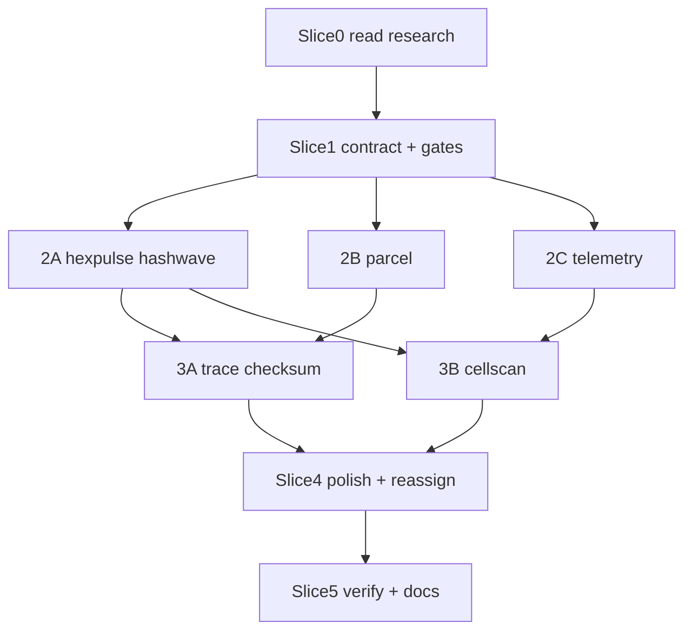

# Goal: Slide Background Effects Rework (Phase 2)

**Use this file as the goal brief.** Primary reference: [`ideas/slide-effects-research.md`](../ideas/slide-effects-research.md). Supporting docs: [`docs/effects-audit.md`](effects-audit.md), [`docs/effects-replacement-plan.md`](effects-replacement-plan.md), [`ideas/website_design_direction.md`](../ideas/website_design_direction.md), [`ideas/deep-research-report animejs (1).md`](../ideas/deep-research-report%20animejs%20(1).md).

**Scope:** Scroll-hero `AnimeEffectsField` canvas backgrounds on production routes (`index`, `about`, `business`, `licensing`, `solutions`, `cortex`). **Out of scope:** `/ideas/` pitch slideshow, hero copy changes, nav/HTML shell migrations.

---

## Goal statement

Plan and execute a cluster-diversifying rework of hero slide/stage background effects: implement **11 new procedural canvas effect IDs** from the research doc, reassign overloaded slide slots (especially `relay`, node-graph, and flow-diagram families), extend the effects contract and verification gates, and pass automated checks, without regressing the shipped anime.js v4 + Canvas 2D architecture.

---

## Non-negotiables (from research, do not regress)

Read `ideas/slide-effects-research.md` §Current style audit → **Preserve** before any implementation:

- `createTimer` render loop + `animate()` state tweens in `assets/effects-anime.js`, OKLCH palette via `effectPalette()` / `colorAtHue()`; 48px CSS atmosphere grid + glow + text veil, Renderer/orchestrator split: anime.js owns timing; canvas owns pixels - **no DOM-per-cell grids**, Centralized pointer policy in `assets/effects-interaction.js` (`hoverAllowed`, `_proximity`, `rowProximity`), no ad-hoc pointer checks, Bokeh + vignette caps; backgrounds stay subordinate to hero copy
- **Reject** as primary architecture: particles.js, Three.js/WebGL, PixiJS, p5.js in production bundle, decorative wallpaper patterns (see research §Non-fit patterns)

---

## Goal success criteria (all must pass)

| # | Criterion | How to verify |
|---|-----------|---------------|
| G1 | All **11 new effect IDs** implemented in `assets/effects-anime.js`: `hexpulse`, `parcel`, `hashwave`, `branch`, `telemetry`, `trace`, `checksum`, `cellscan`, `beacon`, `lattice`, `filament` | Each id in `_createState`, `_bootLoops`, `_drawEffect`; `scripts/test-effects-ids.mjs` passes |
| G2 | Contract updated: `assets/effects-goal-contract.js` lists new IDs in `SHIPPED_EFFECT_IDS`; caps + `INTERACTIVE_EFFECTS` membership per research interaction column | `node scripts/export-effects-contract.mjs` → `scripts/effects-goal-contract.json` valid |
| G3 | **Cluster rebalance** on slide matrix (research §Cluster gap analysis): `relay` ≤3 slots; node-graph (`mesh`/`topology`/`constellation`) ≤5; flow-diagram (`flowchart`/`pipeline`/`schematic`) ≤4; **zero adjacent duplicate** effect pairs on same route | `python scripts/verify-revamp.py .verify-scratch` cluster gates; manual matrix grep |
| G4 | Slide reassignments applied in all `assets/hero-*.js` per §Target reassignment below - **no slide copy/title changes** | Diff hero modules only `effect:` fields; spot-check 3 routes in harness |
| G5 | Each new interactive effect uses `effects-interaction.js` helpers; scroll-sync effects wire `setScrollFrac` where specified (`trace`, `checksum`) | Grep no raw `mousemove` in new `_drawEffect` branches |
| G6 | Reduced-motion: each new effect draws a **static composition** when RM on (research §Reduced-motion mode switch) | Toggle `prefers-reduced-motion` in harness; no infinite stagger/packet churn |
| G7 | Optional geometry deps (`d3-delaunay`, `d3-hexbin`) used **compute-only at resize** for `cellscan`/`hexpulse` only, zero D3 animation runtime | Import audit in `effects-anime.js`; license note in research §Licensing |
| G8 | CSS atmosphere `[data-effect]` variants added in `assets/hero-home.css` for new IDs | Visual distinct grid opacity/size per effect family |
| G9 | `scripts/verify-revamp.py` exit 0; Playwright harness captures non-blank for reassigned slides | `python scripts/verify-revamp.py .verify-scratch` |
| G10 | `docs/effects-replacement-plan.md` updated with Phase 2 reassignment tables (document deviations) | Plan doc reflects post-ship matrix |

**Goal is DONE when G1-G10 all pass.**

---

## Target reassignment (research §Proposed effects, example slides)

Apply these `effect:` changes. Indices are **1-based slide numbers** matching hero modules.

### home (`hero-home.js`, 8 slides)

| # | Title (unchanged) | Current | New |
|---|-------------------|---------|-----|
| 4 | Private AI Infrastructure | `pcb` | **`hexpulse`** |
| 6 | 3.7× Average ROI | `ledger` | **`telemetry`** |
| 8 | Start Small. Prove Value. | `sonar` | **`beacon`** |

### about (`hero-about.js`, 7 slides)

| # | Title | Current | New |
|---|-------|---------|-----|
| 1 | Builders First | `weave` | **`filament`** |
| 3 | Four Durable Principles | `isograph` | **`lattice`** |

### business (`hero-business.js`, 8 slides)

| # | Title | Current | New |
|---|-------|---------|-----|
| 2 | Scope Connect Build | `isograph` | **`lattice`** |
| 3 | Teams That Need Leverage | `mesh` | **`cellscan`** |
| 5 | Consult Pilot Package | `flowchart` | **`branch`** |
| 7 | Not One Tool | `glyph` | **`hashwave`** |
| 8 | $12K → $24K+ | `ledger` | **`telemetry`** |

### licensing (`hero-licensing.js`, 6 slides)

| # | Title | Current | New |
|---|-------|---------|-----|
| 2 | Free For Personal Use | `flowchart` | **`branch`** |
| 4 | Live Operations Path | `relay` | **`parcel`** |
| 6 | Inspectable Boundaries | `seal` | **`checksum`** |

### solutions (`hero-solutions.js`, 10 slides)

| # | Title | Current | New |
|---|-------|---------|-----|
| 4 | Faster Client Response | `relay` | **`parcel`** |
| 5 | Governed Handoffs | `schematic` | **`trace`** |
| 7 | Context That Compounds | `weave` | **`filament`** |
| 9 | Common First Wins | `mesh` | **`cellscan`** |
| 10 | Start With One Wedge | `sonar` | **`beacon`** |

### cortex (`hero-cortex.js`, 10 slides)

| # | Title | Current | New |
|---|-------|---------|-----|
| 2 | Capture Route Execute | `schematic` | **`trace`** |
| 3 | Context Management | `pcb` | **`hexpulse`** |
| 6 | Custody & Governance | `vault` | **`checksum`** |
| 9 | Why Not Another Chatbot | `glyph` | **`hashwave`** |

**Relay retirement from matrix:** after reassignment, `relay` should appear on ≤3 slides total (currently 5×). Prefer keeping `relay` only where baton handoff is the clearest metaphor (e.g. about 7, cortex 8), swap other relay slots to `parcel` or `trace`.

---

## New effect implementation spec (canonical reference)

For each ID, follow the research doc **§Proposed effects** summary table + per-effect notes. Implementation pattern:

```
_createState(effectId) → plain JS state (cells, progress, rings, …)
_bootLoops(effectId)   → animate() / createTimeline() / stagger()
_drawEffect(effectId)  → single canvas pass; OKLCH strokes; particle caps
```

| ID | Priority | Cluster gap | Interaction | RM fallback | Effort |
|----|----------|---------------|-------------|-------------|--------|
| `hexpulse` | P0 | circuit | pointer-proximity | static lit center hex | 0.5-1d |
| `parcel` | P0 | handoff (alt to relay) | pointer-proximity | timer-only packet | 1d |
| `hashwave` | P0 | typographic | pointer-proximity | frozen grid | 1d |
| `telemetry` | P1 | metric | none | static baseline + final tick | 0.5-1d |
| `trace` | P1 | flow-diagram | scroll-sync | `progress: 1` | 1-1.5d |
| `checksum` | P1 | security-ring | scroll-sync | full bar visible | 1d |
| `cellscan` | P2 | node-graph (partition) | pointer-proximity + `delaunay.find` | static edge subset | 1.5-2d |
| `branch` | P3 | flow-diagram | parallax | all nodes visible | 0.5-1d |
| `beacon` | P3 | radar (point-source) | pointer-proximity | static anchors | 0.5-1d |
| `lattice` | P3 | isometric-grid | parallax | single flat grid | 1.5d |
| `filament` | P3 | fabric | parallax | static shortest path | 1d |

**Ranked build order** (research §Ranked implementation order):  
`hexpulse` → `parcel` → `hashwave` → `telemetry` → `trace` → `checksum` → `cellscan` → (`branch` + `beacon`) → (`lattice` + `filament`).

---

## Turn slices (one slice ≈ one orchestrator turn)

### Slice 0, Prerequisite read (orchestrator only, no code)
- **Scope:** Read `ideas/slide-effects-research.md` end-to-end; skim `assets/effects-anime.js` (`pcb`, `relay`, `schematic`, `glyph` as pattern references); `assets/effects-interaction.js`; `assets/effects-goal-contract.js`; `docs/effects-audit.md` §Slide matrix
- **Outputs:** Written plan confirming reassignment table + which relay slots survive
- **Done when:** Orchestrator can list 11 effect IDs with interaction + RM contracts
- **Blocks:** Slice 1

---

### Slice 1, Contract + verification scaffold
- **Scope:** Extend `effects-goal-contract.js` with 11 new IDs; particle cap constants; `INTERACTIVE_EFFECTS` entries; stub cases in `effects-anime.js` (empty/static draw acceptable); extend `test-effects-ids.mjs` and `verify-revamp.py` cluster gates (`relay` ≤3, node-graph ≤5, flow-diagram ≤4, no adjacent dupes)
- **Files:** `effects-goal-contract.js`, `effects-anime.js` (stubs), `test-effects-ids.mjs`, `verify-revamp.py`, `export-effects-contract.mjs`
- **Done when:** Tests fail on missing draw impl but **pass** contract enumeration; cluster gate logic exists
- **Blocks:** Slices 2-4

---

### Slice 2, Parallel fast wins (3 subagents) ⬦

Run **in parallel** after Slice 1.

| Track | Subagent task | IDs | Pattern ref |
|-------|---------------|-----|-------------|
| **2A** | Implement `hexpulse` + `hashwave` | hex lattice stagger; mono glyph wave | `pcb`, `glyph`, `cascade` |
| **2B** | Implement `parcel` | L-shaped path packets | `relay`, `pcb` |
| **2C** | Implement `telemetry` | instrument tick timeline | `ledger`, `signal` |

**Slice 2 done when:** 2A-2C merged; harness smoke-draw for each id; reassign **home 4/6/8**, **business 7/8**, **cortex 3/9** where ids ready.

**Do not start until:** Slice 1

---

### Slice 3, Flow + security medium batch (2 subagents) ⬦

| Track | Subagent task | IDs |
|-------|---------------|-----|
| **3A** | `trace` + `checksum` (scroll-sync via `setScrollFrac`) | `schematic` reference |
| **3B** | `cellscan` (resize-time `d3-delaunay`; ≤16 sites, ≤40 edges) | `mesh` inverse, partition not hub-spoke |

**Slice 3 done when:** 3A + 3B merged; reassign solutions 5, cortex 2/6, business 3, solutions 9, licensing 6.

**Do not start until:** Slice 2

---

### Slice 4, Polish batch + remaining reassignments
- **Scope:** `branch`, `beacon`, `lattice`, `filament`; CSS `[data-effect]` variants; apply all remaining hero `effect:` swaps; trim `relay` to ≤3
- **Files:** `effects-anime.js`, `hero-*.js`, `hero-home.css`
- **Done when:** G4 pass; all 11 ids draw correctly

---

### Slice 5, Lifecycle + docs + final verify
- **Scope:** `ResizeObserver` / optional `IntersectionObserver` on `.hero-stage` (research §Lifecycle hooks); DPR clamp on heavy effects; update `docs/effects-replacement-plan.md` Phase 2 tables; run full verify + harness capture
- **Files:** `effects-anime.js`, `hero-core.js`, `effects-replacement-plan.md`
- **Done when:** G1-G10 pass; **goal complete**

---

## Parallel execution map



**Maximum parallelism:** 3 subagents (Slice 2) + 2 subagents (Slice 3).

---

## Subagent brief templates (copy-paste)

### 2A, hexpulse + hashwave
```
Task: Implement hexpulse and hashwave in assets/effects-anime.js per
ideas/slide-effects-research.md §Proposed effects. hexpulse: center-out stagger on
hex cell alpha/scale (optional d3-hexbin at resize). hashwave: horizontal brighten
band on mono glyph grid (#[]{}01λ∆), brief scramble on pointer proximity.
Use effects-interaction.js for hover; RM = static composition. Particle caps ≤80 full / ≤40 RM.
Do not edit hero-*.js. Return: line counts + interaction summary.
```

### 2B, parcel
```
Task: Implement parcel in assets/effects-anime.js, data packets on L-shaped
orthogonal paths between stations (handoff alt to relay). animate({ t }) on piecewise
path; pointer-proximity speeds nearest packet. RM: timer-only loop, no pointer branch.
Reference relay + pcb patterns. Do not edit hero modules.
```

### 2C, telemetry
```
Task: Implement telemetry, instrument strip with micro-ticks climbing a baseline.
createTimeline + stagger(10) on tick y. Copper/blue OKLCH palette. No pointer
interaction. RM: static baseline + final tick visible. Reference ledger/signal.
```

### 3A, trace + checksum
```
Task: Implement trace (orthogonal route self-draw, progress per segment, optional
setScrollFrac) and checksum (verify bar + staggered tick marks, scroll-driven).
RM: progress=1 / full bar. Reference schematic. Wire scroll fraction like schematic.
```

### 3B, cellscan
```
Task: Implement cellscan, Voronoi partition, sparse edge subset only (≤16 sites,
≤40 edges). d3-delaunay at resize; pointer → delaunay.find(px,py) cell bloom.
RM: static edges. Distinct from mesh hub-spoke. ISC license compute-only.
```

### 4P, polish quartet (optional subagent)
```
Task: Implement branch, beacon, lattice, filament per research doc. Add hero-home.css
[data-effect] rules for all 11 new IDs. Do not reassign hero slides, orchestrator merges.
```

---

## Per-slice verification commands

```bash
# After Slice 0
rg "hexpulse|parcel|hashwave|trace|cellscan" ideas/slide-effects-research.md

# After Slice 1
node scripts/test-effects-ids.mjs
node scripts/export-effects-contract.mjs

# After Slice 2+
rg "hexpulse|parcel|hashwave|telemetry" assets/effects-anime.js

# After Slice 3
rg "trace|checksum|cellscan" assets/effects-anime.js

# After Slice 4, cluster caps
rg 'effect: "(relay|mesh|topology|constellation|flowchart|pipeline|schematic)"' assets/hero-*.js

# After Slice 5
python scripts/verify-revamp.py .verify-scratch
node scripts/build-effects-harness.mjs   # if harness stale
```

---

## Risk gates (orchestrator stops and fixes before continuing)

| Gate | Condition | Action |
|------|-----------|--------|
| R1 | Any new effect throws on slide change | Fix draw path before next slice |
| R2 | `relay` still >3 after Slice 4 | Swap remaining relay slots to `parcel`/`trace` per research |
| R3 | Adjacent duplicate effects on one route | Reassign one slot using under-used cluster id |
| R4 | Subagents both edit `effects-anime.js` | Orchestrator serializes merge |
| R5 | Canvas illegible behind hero text | Lower alpha / tighten caps; check `.text-veil` |
| R6 | D3 imported for animation | Refactor to resize-time compute only |
| R7 | Goal scope creep into `/ideas/` slideshow | Revert; hero routes only |

---

## Goal-scoped files

Work stays inside `scripts/goal-effects-scope.txt` (26 paths). Stage with:

```bash
node scripts/stage-effects-goal.mjs .verify-scratch
```

---

## Goal metadata

| Field | Value |
|-------|-------|
| Primary reference | [`ideas/slide-effects-research.md`](../ideas/slide-effects-research.md) |
| Estimated turns | 5 orchestrator + up to 7 subagent |
| Critical path | S0 → S1 → S2 → S3 → S4 → S5 |
| New effect count | 11 |
| Slide slots touched | ~22 reassignments across 6 routes |
| Architecture | anime.js v4 + Canvas 2D (unchanged) |

---

## Turn checklist (orchestrator copy)

```
[x] Slice 0, Read ideas/slide-effects-research.md + audit matrix
[x] Slice 1, Contract stubs + verify cluster gates (G2 partial)
[x] Slice 2, Parallel: 2A hexpulse/hashwave | 2B parcel | 2C telemetry (G1 partial)
[x] Slice 3, Parallel: 3A trace/checksum | 3B cellscan (G1 partial, G7)
[x] Slice 4, branch/beacon/lattice/filament + hero reassignments + CSS (G4, G8)
[x] Slice 5, Lifecycle hooks + docs + verify-revamp (G3, G5, G6, G9, G10)
[x] GOAL COMPLETE, all G1-G10 pass
```

---

## Grok Goal Mode entry prompt (paste below)

```
Goal: Slide Background Effects Rework (Phase 2)

Use docs/slide-effects-rework-goal.md as the orchestration brief. Read ideas/slide-effects-research.md as the authoritative design reference before writing any code.

Objective: Plan and execute implementation of 11 new AnimeEffectsField background effects (hexpulse, parcel, hashwave, branch, telemetry, trace, checksum, cellscan, beacon, lattice, filament), reassign ~22 overloaded hero slide slots to diversify effect clusters, and pass all verification gates, without changing slide copy or adopting rejected patterns (WebGL, particles.js, decorative wallpaper).

Constraints:, Scroll-hero routes only (index, about, business, licensing, solutions, cortex), Preserve anime.js v4 createTimer + canvas _draw architecture, All pointer logic via assets/effects-interaction.js, Reduced motion = static composition per effect, Cluster targets: relay ≤3, node-graph ≤5, flow-diagram ≤4, zero adjacent duplicates

Start with Slice 0 (read-only). Report the reassignment plan and which relay slots you will keep before implementing. Work slice-by-slice; use parallel subagents where the brief marks ⬦. Run python scripts/verify-revamp.py .verify-scratch before marking the goal complete.
```